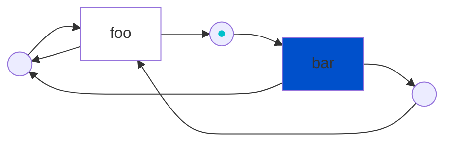

# Symmetri

A C++-17 library that takes a Petri net and turns it into a program. This is done by mapping *[transitions](https://en.wikipedia.org/wiki/Petri_net#Petri_net_basics)* to *functions* and calling the functions for which their transition counterpart is *[fireable](https://en.wikipedia.org/wiki/Petri_net#Execution_semantics)*. Petri nets are a graphical language that naturally can model concurrent and distributed systems ([*wikipedia*](https://en.wikipedia.org/wiki/Petri_net#Petri_net_basics)).

## Principle

The graph below represents a Petri net. The transitions `bar` is fireable, and if it would fire it would consume the *token* (<span style="color:#00c0cb;">&#9679;</span>) and produce two new tokens in the output places. These new tokens would enable `foo` and the cycle would continue for ever, while accumelating tokens in the most left place.



This Petri net can be described using Symmetri:

```cpp
using namespace symmetri;
Net net = {{"foo",
            {{{"B", Color::Success}, {"C", Color::Success}},
              {{"Z", Color::Success}, {"B", Color::Success}}}},
            {"bar",
            {{{"Z", Color::Success}},
              {{"B", Color::Success}, {"C", Color::Success}}}}};
Marking initial = {{"Z", Color::Success}};
Marking goal = {};
auto task_system = std::make_shared<TaskSystem>(4);
PetriNet app(net, "test_net_without_end", pool, initial, goal);
app.registerCallback("foo", &foo);
app.registerCallback("bar", &bar);
auto result = fire(app);  // run until done.
auto log = getLog(app); // get the event log
```

- `net` is a multiset description of a Petri net
- `initial` is the initial token distribution (also known as _initial marking_)
- `goal` is the goal marking, the net terminates if this is reached
- `task_system` is a simple SPMC-queue based based threadpool
- `&foo` and `&bar` are user-supplied *Callbacks*
- `app` is all the ingredients put together - creating something that can be *fired*! it outputs a result (`res`) and at all times an event log can be queried

## Build

Clone the repository, initialize the submodules, and make sure to enable the proper `gcc` compiler. Then, check out the `tst_v0.9.0` branch.

```bash
git clone https://github.com/thorstink/Symmetri.git
git submodule update --init --recursive
scl enable gcc-toolset-11 bash
git checkout tst_v0.9.0
```

For the `tst_v0.9.0` branch, you can build the Symmetri as a static or shared library, either with the examples and tests. The following steps show how to build the library with different configurations.

### Build a shared library

```bash
mkdir build
cd build
# Debug build without santiizers and as a shared library
cmake -DCMAKE_BUILD_TYPE=Debug -DBUILD_EXAMPLES=ON -DBUILD_TESTING=ON -DASAN_BUILD=OFF -DTSAN_BUILD=OFF -DBUILD_SHARED_LIBS=ON ..
# Building and running tests:
make && make test
```

### Build a static library

Building `Symmetri` as a static library involves several steps.

1. **Build as a static library** Begin by building Symmetri the same wasy as above, except this time, you will not include the `-DBUILD_SHARED_LIBS=ON` flag.

    ```bash
    mkdir build
    cd build
    # Debug build without sanitizers and as a static library
    cmake -DCMAKE_BUILD_TYPE=Debug -DBUILD_EXAMPLES=ON -DBUILD_TESTING=ON -DASAN_BUILD=OFF -DTSAN_BUILD=OFF ..
    # Building and running tests:
    make && make test
    ```
2.  **Locate the `libsymmetri.a` File (Static Library) and `nets` directory** Given our project organization, the `libsymmetri.a` file and `nets` directory are located here:
    ```bash
    build/symmetri/libsymmetri.a
    ./nets
    ```
    You will copy these files over to our sim project's root directory during the next step.

3. **Collect and prepare header and net files** The header files for Symmetri are dispersed throughout the project. Copy all header files over to your project's root directory and maintain the directory structure. Then, copy over your `libsymmetri.a` file and the `nets` directory. Your directory structure should look something like this:
    ```bash
    sim_project/
    ├── externals/        # Copy the appropriate externals header files here
    ├── include/
    │   ├── symmetri/     # Copy the appropriate symmetri header files here
    ├── lib/
    |   ├── libsymmetri.a # Copy the libsymmetri.a static library here
    ├── nets/             # Copy the nets directory here
    ├── submodules/
    |   ├── tinyxml2/     # Copy the appropriate submodules header files here
    |── src/
    ├── tests/
    |   ├── doctest/      # Copy the appropriate tests header files here
    ```

4. **Link the Static Library to Your Project via our sim project's build** Now that you have everything set up, head on over to our sim project's directory and follow the steps for compiling and linking the Symmetri static library to the necessary subproject.

## Run examples via a shared library build

From the `Symmetri` root directory, you can run the examples. The following command runs the `flight` example with three Petri nets as input:
```bash
# assumes you build a shared library
# assumes you build the examples
# finishes by reaching the final marking (e.g. completed). Use keyboard to interact pause/resume/cancel/print log
./build/examples/flight/symmetri_flight nets/PT1.pnml nets/PT2.pnml nets/PT3.pnml
```

## Implementation

Some details on the implementation.

<p align="center" width="100%">
<picture>
  <source media="(prefers-color-scheme: dark)" srcset="./docs/img/architecture_dark.svg">
  <source media="(prefers-color-scheme: light)" srcset="./docs/img/architecture_light.svg">
  
</picture>
</p>

## State of the library

Still in alpha! Improving as we go. None the less, Symmetri is already being used in industry ;-). Feel free to contact me if you are curious or have questions.

